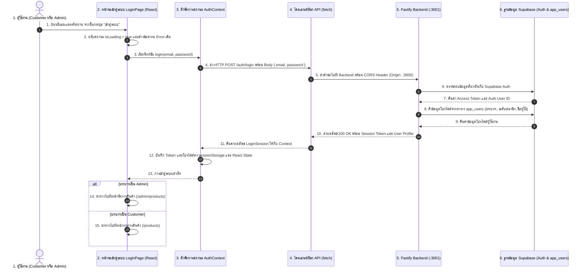

# แผนงาน: เชื่อมต่อหน้าจอ Login (Frontend) เข้ากับ Fastify Backend

## สรุปภาพรวม (Summary)

เชื่อมต่อหน้าจอเข้าสู่ระบบของ React Frontend (`frontend/src/pages/login.tsx`) เข้ากับระบบยืนยันตัวตน Fastify Backend (`POST /auth/login`) บนพอร์ต 3001 โดยเปลี่ยนจากการจำลอง (Mock) ในฝั่ง Client เป็นการส่งคำขอ HTTP จริง, จัดการสถานะการเข้าสู่ระบบแบบ Reactive ด้วย `AuthContext` ร่วมกับ `sessionStorage`, แสดงผลสถานะข้อผิดพลาดเป็นภาษาไทยตามข้อกำหนด DC-2 (`app-message`), และสลับเส้นทางนำทาง (Route) ตามบทบาทของผู้ใช้จริง (`admin` หรือ `customer`)

## ข้อกำหนดผู้ใช้งาน (User Story)

ในฐานะ Customer หรือ Admin,  
ฉันต้องการเข้าสู่ระบบด้วยอีเมลและรหัสผ่านที่ลงทะเบียนไว้ผ่านหน้าจอ Frontend,  
เพื่อให้ได้รับ Token ยืนยันตัวตน, โหลดข้อมูลโปรไฟล์ของฉัน, และถูกนำทางไปยังหน้ารายการสินค้าหรือหน้าแอดมินตามสิทธิ์ที่ถูกต้อง

## ข้อมูลแผนงาน (Metadata)

| หัวข้อ | รายละเอียด |
|---|---|
| ประเภทงาน (Type) | ENHANCEMENT (ปรับปรุงและเชื่อมต่อระบบ) |
| ความซับซ้อน (Complexity) | MEDIUM (ระดับปานกลาง) |
| ระบบที่เกี่ยวข้อง (Systems Affected) | `frontend` (AuthContext, API Client, Login Page, AppShell, Router), `backend` (การตั้งค่าพอร์ตและ CORS ใน `.env`) |
| Jira Issue | N/A |

---

## แผนภาพลำดับขั้นตอนการทำงาน (Workflow Diagram)



---

## รูปแบบโค้ดที่ต้องยึดตาม (Patterns to Follow)

### ตัวอย่างการรับคำขอใน Backend
```typescript
// แหล่งอ้างอิง: backend/src/controllers/auth-controller.ts:6-18
app.post('/auth/login', async (request, reply) => {
  const input = bodyObject(request.body, ['email', 'password']);
  const email = stringField(input, 'email').trim();
  const password = stringField(input, 'password');
  // ...
  const session = await service.login(email, password);
  return { data: session, messages: [] };
});
```

### การจัดการ Error และแสดงข้อความแจ้งเตือนตามมาตรฐาน DC-2
```typescript
// แหล่งอ้างอิง: frontend/components/commerce/ui.tsx:14-29
export function AppMessage({ kind = "info", code = "", children }: AppMessageProps) {
  return (
    <div
      className={`app-message app-message--${kind}`}
      data-testid="app-message"
      data-kind={kind}
      data-code={code}
      role={kind === "error" ? "alert" : "status"}
      aria-live={kind === "error" ? "assertive" : "polite"}
    >
      <span className="app-message-mark" aria-hidden="true">
        {kind === "error" ? "!" : "i"}
      </span>
      <p>{children}</p>
    </div>
  );
}
```

### โครงสร้างข้อมูล Session (Data Contracts)
```typescript
// แหล่งอ้างอิง: backend/src/services/auth-service.ts:4-6
export interface LoginSession extends Omit<AuthSession, 'user'> {
  user: AuthSession['user'] & { username: string; role: 'admin' | 'customer'; memberTier: 'free' | 'prime' };
}
```

---

## รายการไฟล์ที่ต้องเปลี่ยนแปลง (Files to Change)

| ไฟล์ | การดำเนินการ | วัตถุประสงค์ |
|---|---|---|
| `backend/.env` | แก้ไข (UPDATE) | กำหนด `API_PORT=3001` และ `UI_ORIGIN=http://localhost:3000` เพื่อป้องกันพอร์ตชนกันและอนุญาต CORS |
| `frontend/src/lib/api-client.ts` | สร้างใหม่ (CREATE) | สร้างโมดูลเรียก Backend API กลาง จัดการ Base URL, Headers และแปลง Error Response |
| `frontend/src/context/auth-context.tsx` | สร้างใหม่ (CREATE) | จัดการ React Context และ Hook `useAuth` ดูแล Token, ข้อมูลผู้ใช้, และซิงก์กับ `sessionStorage` |
| `frontend/src/App.tsx` | แก้ไข (UPDATE) | ครอบ Application Routing ด้วย `AuthProvider` |
| `frontend/src/pages/login.tsx` | แก้ไข (UPDATE) | เชื่อมต่อ `useAuth().login()`, แสดงสถานะกำลังโหลด, แสดง Error Message ภาษาไทยตาม DC-2 และแสดงตัวอย่างบัญชี Seed |
| `frontend/components/commerce/shell.tsx` | แก้ไข (UPDATE) | ปรับ `AppShell` ให้อ่าน Role ปัจจุบันจาก `useAuth()` เพื่อแสดงเมนูนำทางตามสิทธิ์ |

---

## ลำดับงานที่ต้องปฏิบัติ (Tasks)

โปรดดำเนินการตามลำดับ แต่ละงานสามารถตรวจสอบความถูกต้องได้

### Task 1: ตั้งค่าพอร์ต Backend และ CORS Origin

- **ไฟล์**: `backend/.env`
- **การดำเนินการ**: แก้ไข (UPDATE)
- **สิ่งที่ต้องทำ**:
  - กำหนด `API_PORT=3001`
  - กำหนด `UI_ORIGIN=http://localhost:3000`
- **การตรวจสอบ**: ตรวจสอบว่า Backend เริ่มทำงานบนพอร์ต 3001 สำเร็จ

### Task 2: สร้างโมดูล API Client ฝั่ง Frontend

- **ไฟล์**: `frontend/src/lib/api-client.ts`
- **การดำเนินการ**: สร้างใหม่ (CREATE)
- **สิ่งที่ต้องทำ**:
  - สร้างฟังก์ชัน `loginApi(email: string, password: string)` เพื่อส่งคำขอไปที่ `http://localhost:3001/auth/login`
  - รองรับ Success Envelope `{ data: LoginSession, messages: [] }`
  - ถอดรหัส Error Envelope `{ error: { code: string, message: string } }` และ Throw ออกมาเป็น `ApiError` พร้อม Status Code และ Error Code
- **โค้ดอ้างอิง**: `backend/src/controllers/auth-controller.ts:6-25`
- **การตรวจสอบ**: รันตรวจสอบ TypeScript Type ผ่านฉลุยในโฟลเดอร์ `frontend`

### Task 3: สร้าง Auth Context และ Hook

- **ไฟล์**: `frontend/src/context/auth-context.tsx`
- **การดำเนินการ**: สร้างใหม่ (CREATE)
- **สิ่งที่ต้องทำ**:
  - สร้าง `AuthProvider` และ Hook `useAuth()`
  - จัดเก็บ `accessToken`, `refreshToken`, และข้อมูล `user` (`{ userId, username, email, role, memberTier }`)
  - โหลดสถานะเริ่มต้นจาก `sessionStorage` (`access_token`, `refresh_token`, `user_role`, `username`, `user_id`, `member_tier`)
  - เตรียมฟังก์ชัน `login(email, password)` และ `logout()`
  - ซิงก์ค่าลง `sessionStorage` ตลอดเพื่อรองรับโค้ดหน้าจอเดิม
- **การตรวจสอบ**: รันตรวจสอบ TypeScript Type ผ่านฉลุยในโฟลเดอร์ `frontend`

### Task 4: เชื่อมต่อ AuthProvider เข้ากับ App Root

- **ไฟล์**: `frontend/src/App.tsx`
- **การดำเนินการ**: แก้ไข (UPDATE)
- **สิ่งที่ต้องทำ**:
  - ครอบ `<Routes>` ด้วย `<AuthProvider>`
- **การตรวจสอบ**: ทดสอบ Build ด้วย `npm run build` ในโฟลเดอร์ `frontend`

### Task 5: เชื่อมต่อหน้าจอ Login เข้ากับ Backend

- **ไฟล์**: `frontend/src/pages/login.tsx`
- **การดำเนินการ**: แก้ไข (UPDATE)
- **สิ่งที่ต้องทำ**:
  - แทนที่โค้ด Mock Login เดิมด้วยการเรียก `useAuth().login(email, password)`
  - คงค่า `data-testid="login-username"` บนช่องกรอกอีเมล โดยเปลี่ยน Label ให้ชัดเจนเป็น "อีเมล"
  - เพิ่ม State สำหรับ `isLoading` และ `error` (`{ code: string, message: string } | null`)
  - นำเสนอ Error แจ้งเตือนผ่าน `PageScaffold` โดยส่งค่า `message` พร้อม `messageKind="error"` และ `messageCode={error.code}`
  - แปลงรหัส Error สากลเป็นข้อความภาษาไทยที่เข้าใจง่าย:
    - `AUTH_INVALID_CREDENTIALS` -> `"อีเมลหรือรหัสผ่านไม่ถูกต้อง"`
    - `VALIDATION_ERROR` -> `"รูปแบบอีเมลหรือรหัสผ่านไม่ถูกต้อง"`
    - `AUTH_EMAIL_NOT_CONFIRMED` -> `"กรุณายืนยันอีเมลก่อนเข้าสู่ระบบ"`
    - `AUTH_PROFILE_NOT_FOUND` -> `"ไม่พบข้อมูลโปรไฟล์ผู้ใช้ในระบบ"`
    - `AUTH_RATE_LIMITED` -> `"คุณพยายามเข้าสู่ระบบถี่เกินไป กรุณารอสักครู่"`
    - `AUTH_UNAVAILABLE` -> `"ระบบยืนยันตัวตนไม่พร้อมใช้งานชั่วคราว"`
    - กรณีอื่นๆ -> `error.message || "เกิดข้อผิดพลาดในการเข้าสู่ระบบ"`
  - ปิดการใช้งานปุ่ม (Disable) ระหว่างอยู่ในสถานะ `isLoading`
  - ปรับปรุงข้อความ Footnote ให้แสดงคำแนะนำบัญชี Seed สำหรับทดสอบทั้ง Customer และ Admin
- **โค้ดอ้างอิง**: `frontend/components/commerce/ui.tsx:55-63`
- **การตรวจสอบ**: ทดสอบส่งฟอร์มในเบราว์เซอร์ ยืนยันการนำทางเมื่อสำเร็จ และการแสดงข้อความแจ้งเตือนเมื่อผิดพลาด

### Task 6: ซิงก์ Navigation Shell ให้ตรงกับสถานะ Auth

- **ไฟล์**: `frontend/components/commerce/shell.tsx`
- **การดำเนินการ**: แก้ไข (UPDATE)
- **สิ่งที่ต้องทำ**:
  - กำหนดให้ `AppShell` ดึง `role` จาก `useAuth()` โดยอัตโนมัติหากไม่มีการระบุ prop
  - ผู้ใช้ Admin จะเห็นเมนูผู้ดูแล (`จัดการสินค้า`, `จัดการคูปอง`) และ Customer จะเห็นเมนูลูกค้า (`สินค้า`, `รถเข็น`, `คำสั่งซื้อ`)
- **การตรวจสอบ**: เข้าสู่ระบบเป็น Admin ต้องเห็นเมนู Admin และเข้าสู่ระบบเป็น Customer ต้องเห็นเมนู Customer

---

## การตรวจสอบความถูกต้อง (Validation)

```bash
# 1. ตรวจสอบ Typecheck ของ Frontend
cd frontend && npm run typecheck

# 2. ตรวจสอบการ Build ของ Frontend
npm run build

# 3. ตรวจสอบการเชื่อมต่อกับ Backend
# รัน Backend บนพอร์ต 3001 และทดสอบล็อกอินจาก Frontend พอร์ต 3000
```

---

## เกณฑ์การยอมรับงาน (Acceptance Criteria)

- [ ] Backend รันบนพอร์ต 3001 พร้อม `UI_ORIGIN=http://localhost:3000`
- [ ] Frontend ส่งคำขอไปยัง `http://localhost:3001/auth/login` ได้อย่างถูกต้อง
- [ ] เมื่อข้อมูลถูกต้อง ล็อกอินสำเร็จ บันทึก JWT & ข้อมูลผู้ใช้ลง `sessionStorage` และเปลี่ยนหน้าไปที่ `/admin/products` (Admin) หรือ `/products` (Customer)
- [ ] เมื่อข้อมูลไม่ถูกต้อง แสดง `AppMessage` ชนิด `data-kind="error"` พร้อมระบุ `data-code` ตรงกับ Error Code จากระบบ
- [ ] Test ID ที่จำเป็นตามมาตรฐาน DC-2 (`page-login`, `login-username`, `login-password`, `login-submit`, `app-message`) ยังคงอยู่อย่างครบถ้วน
- [ ] รันคำสั่ง `npm run build` ในโฟลเดอร์ `frontend` สำเร็จโดยไม่มีข้อผิดพลาด
