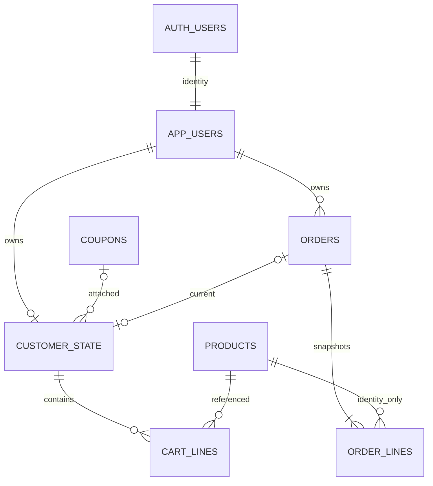

# Supabase database, Auth and security specification

Supabase PostgreSQL เป็นฐานข้อมูลที่ผู้ใช้กำหนด. Supabase Auth ใช้สำหรับ seeded identities; business writes ต้องผ่าน api-server ไม่ผ่าน frontend Supabase SDK. SQL companion เป็น proposed initial migration ไม่ใช่หลักฐานว่า deploy แล้ว

## Project topology / environments

- local/test: Supabase CLI local stack (Docker) + disposable test database; never point reset/integration tests at shared live project
- development/demo: dedicated Supabase project แยกจาก production; production deployment ไม่อยู่ใน term scope แต่ต้องไม่เปิด test controls
- backend uses `pg` direct DB connection or Supabase **session-mode pooler** เมื่อ direct connection/IPv6 ไม่พร้อม. ใช้ checked-out client เดียวจนจบ transaction; ไม่ใช้ transaction-mode pooler สำหรับ session-dependent code
- migrations via Supabase CLI SQL migrations reviewed in git; seeder via server-only script. Frontend does not receive DB password/service_role/secret key
- disable email signups/anonymous sign-ins; Auth identity creation by seeder with admin API only. ไม่ใช้นโยบาย role จาก user_metadata ที่ user เปลี่ยนเองได้

## Entity model

| Table | Key and fields | Invariants / indexes |
|---|---|---|
| app_users | id uuid FK auth.users, username unique case-sensitive, auth_email unique internal, role, member_tier nullable | Customer tier normal/prime; Admin tier null; no UI update |
| customer_state | customer_id PK/FK app_users, stage, coupon_code nullable FK, current_order_id nullable FK | cart reference null; checkout/success reference nonnull; current order belongs to customer and pending/paid as appropriate; stage application enforced plus deferred trigger |
| products | product_id text PK, name, price integer, weight_gram integer, available_stock bigint, status | price 1..50000, weight>0, stock>=0; **no max stock 9999 storage constraint**; stock inputs still max9999 |
| coupons | code text PK, percent integer, min_spend integer, status | case-sensitive exact text; no citext/normalization. percent 0..100/min_spend>=0 DESIGN invariant seeded only |
| cart_lines | customer_id + product_id composite PK, quantity int | quantity 1..10; one line per product; no copies of live price/name |
| orders | order_id UUID PK, sequence bigint identity unique, owner_id FK app_users, status, created_at timestamptz, totals, zone/speed,coupon_code snapshot,discount_source,total_weight_gram | index(owner_id,created_at DESC,sequence DESC); net=subtotal-discount+shipping; data never changes except status |
| order_lines | order_id + product_id PK, name_snapshot,unit_price,quantity,weight_gram | immutable; FK product only as identity; never live join for snapshot DTO |

Orders coupon_code is snapshot text **not FK requiring current active coupon**. Store status not reservation-expiry time. Pending lines embody reservation; separate inventory ledger/payment attempts unnecessary for scope. Do not store session/token/password in domain tables. Stage belongs customer not auth session

## PostgreSQL constraints vs application invariants

SQL CHECK for domains/positive integers/total equation, FK and unique keys. A deferred state validation trigger checks Customer role, current-order owner/status on customer_state update and orders status update after all transaction writes. Inserts pay/cancel must satisfy invariant at commit; order status changes before stage update are allowed inside transaction. Snapshot write protection trigger permits only pending->paid/cancelled status updates and prevents all other order field changes; order_lines UPDATE/DELETE denied except reset via transactional TRUNCATE in test. DB does not duplicate discount/shipping algorithms; DC-1 TypeScript remains authority

RLS is defense-in-depth, not replacement for role/ownership in HTTP. Enable RLS on all public domain tables, revoke all table and sequence access from anon/authenticated, and define **no client policies**. A browser with valid Supabase JWT must not read/write any domain table through REST/GraphQL; even owner reads use api-server. Backend pg connection uses server-only trusted DB credential (default postgres credential for initial project). That credential bypasses RLS, so HTTP checks and restrictions on credential availability are mandatory. Future least-privilege app role is optional hardening, not an unimplemented guarantee

No public SECURITY DEFINER business RPCs. Default function execute privileges must be revoked for any custom function exposed in public; trigger functions are not callable business endpoints. Realtime publication not needed; do not add tables. Do not expose auth_email in API. Supabase storage buckets unnecessary

## Seed and migration procedure

1. Start local stack / select explicitly named Supabase development project; validate APP_ENV and target before any destructive action.
2. Apply versioned initial schema; never overwrite existing migrations. SQL schema companion contains structural design, append a timestamped migration in implementation.
3. Create three Auth identities with admin createUser using configured internal email and password; email_confirm=true. Use stable mapping returned UUID -> app_users, not assumptions about Auth-generated IDs. Skip existing identity safely; do not reset passwords on every app start.
4. Insert app_users cus_normal(Customer,normal), cus_prime(Customer,prime), admin01(Admin,null), customer_state cart/null/null for Customers only.
5. Seed exact products P1 Coffee Beans 250g/450/300/20/onSale, P2 Drip Kettle/1200/900/3/onSale, P3 Espresso Machine/15000/8000/5/onSale; SAVE10/10/1000/active.
6. Seeder idempotent for provisioning missing accounts; domain reset is a separate explicit test-only command. Production startup must not overwrite Admin edits.

Passwords not in SRS: require SEED_PASSWORD_CUS_NORMAL, SEED_PASSWORD_CUS_PRIME, SEED_PASSWORD_ADMIN01 outside local test. Local test may set all to `cart-test-only-password` as synthetic fixture; never reuse for public demo. Internal email names chosen by fixture (e.g. cus_normal@cart.test); username remains public login identifier. Supabase Auth network operations cannot share PostgreSQL business transaction: provision identities first, then transactionally seed domain data; failure exits with recoverable retry, not half-success report

## Test reset

POST /test/reset exists only APP_ENV=test, additionally validate test target allowlist + X-Test-Reset-Token. Queue with other commands. Within transaction TRUNCATE customer_state/cart_lines/order_lines/orders/products/coupons as dependent set (no auth.users/app_users truncation), RESTART IDENTITY; reinsert exact product/coupon seeds and two empty Customer states. Preserve seeded Auth/app_users identity mapping; test clients login fresh and clear browser storage. Domain reset covers every item in DC-3.1. No logout/session expiry task clears business state

Auth provisioning separate once per test stack; reset must fail if identities absent rather than inventing users mid-request. Missing/wrong test secret => 403 generic test-control error (not SRS role code); outside test route absent. Reset secret is not JWT/service-role key. Schema constraints/triggers must allow complete set TRUNCATE; never disable triggers globally for ordinary mutation

## Reservations and examples

- Checkout P2×3: available_stock 3->0; pending lines qty3; cart unchanged.
- payFail/relogin: stock0 remains; no expiry.
- paySuccess: stock0 remains, cart cleared.
- cancel: add3 to current stock; with Admin stock=7 during pending =>10, not3 or7.
- Admin sets price500: live cart subtotal changes, order unit price450 unchanged.
- Admin sets stock9999 during pending qty3; cancel ->10002. Input bound not total inventory bound.

## Backup / deployment boundaries

Use Supabase managed backups according to chosen plan (do not claim PITR included on every plan). Migration verification and restore practice on disposable environment only. Connection TLS for remote DB according to Supabase connection configuration; never disable certificate checks globally. API instance count=1 per SRS serialization assumption. No direct SQL edits while app processing for normal operation. CLI `db reset` local only; remote migration apply must not implicitly run destructive seed reset
